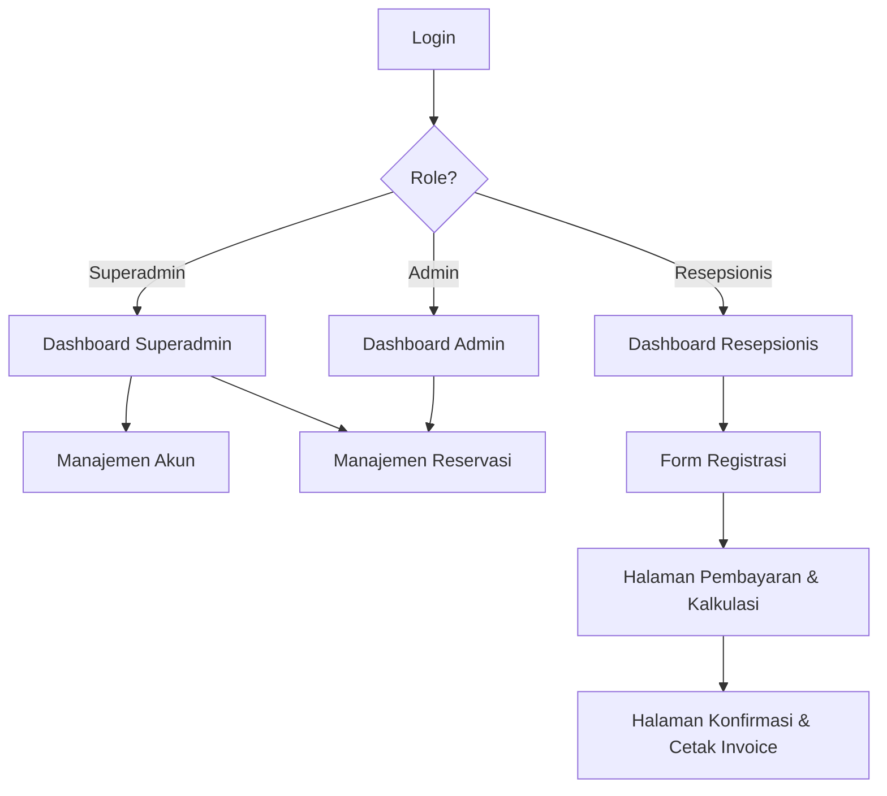

# 🏨 PPKD Hotel — Reservation System

Sebuah aplikasi web modern (berbasis React dan Supabase) untuk manajemen registrasi tamu, autentikasi berbasis role (Admin, Superadmin, Resepsionis), dan pembuatan invoice reservasi (A4 Print-ready).

---

## 🚀 Fitur Utama

- **Sistem Autentikasi & Role-Based Access Control (RBAC):** Memisahkan hak akses antara `Resepsionis`, `Admin`, dan `Superadmin`.
- **Manajemen Pengguna (User Management):** Superadmin dapat menambah, mengedit role, dan menghapus akun staf.
- **Form Reservasi Dinamis:** Pengisian data tamu, kamar, dan periode menginap secara detail dilengkapi validasi.
- **Sistem Pembayaran Terpadu:** Kalkulasi otomatis untuk harga kamar (berdasarkan tipe kamar), PPN (11%), dan Service Charge (5%). Mendukung pembayaran via **Tunai (Cash)**, **Transfer Bank**, **Kartu Kredit**, dan **E-Wallet** (GoPay, OVO, DANA, LinkAja).
- **Kode Referensi Unik:** Menghasilkan kode referensi pembayaran otomatis untuk setiap transaksi non-tunai (misal: `CC-XXXXX`, `GO-XXXXX`, `MANDIRI-XXXXX`).
- **Cetak Konfirmasi (Print-Ready A4):** Halaman konfirmasi dan struk pelunasan dirancang seragam dengan Tailwind CSS `@media print` sehingga pas di kertas A4 dari Dashboard, Reservasi, maupun halaman Sukses.
- **UI/UX Premium:** Dilengkapi dengan *animated background gradients*, transisi halus, dan komponen `CustomAlert` untuk notifikasi yang elegan.

---

## 🛠 Tech Stack

- **Frontend:** [React](https://react.dev/) + [Vite](https://vite.dev/)
- **Styling:** [Tailwind CSS v4](https://tailwindcss.com/)
- **Routing:** [React Router DOM](https://reactrouter.com/)
- **Backend & Database:** [Supabase](https://supabase.com/) (PostgreSQL & Supabase Auth)
- **Deployment:** [Vercel](https://vercel.com/) (Dianjurkan)

---

## 📋 Alur Kerja (Work Flow)



---

## 🚀 Cara Instalasi & Setup

### 1. Clone & Install Dependencies
```bash
git clone https://github.com/RissN/hotel-app.git
cd hotel-app
npm install
```

### 2. Setup Supabase
Aplikasi ini membutuhkan Supabase untuk Auth dan Database.

1. Buat project baru di [Supabase](https://supabase.com).
2. Dapatkan `Project URL` dan `API Key (anon/public)`.
3. Buat file `.env` di folder root project:
   ```env
   VITE_SUPABASE_URL=your_supabase_url
   VITE_SUPABASE_ANON_KEY=your_supabase_anon_key
   ```

### 3. Setup Database (SQL Migrations)
Jalankan script SQL berikut di menu **SQL Editor** pada dashboard Supabase untuk menyiapkan tabel dan fungsi yang diperlukan:

1. **Jalankan script pembuatan tabel & trigger** yang ada di panduan Supabase Setup awal Anda (untuk `user_roles`, `identities`, dll).
2. **Jalankan Fungsi Manajemen User** (Untuk digunakan oleh Superadmin di menu Manajemen Akun):

```sql
-- Fungsi untuk menambahkan user baru dengan role
CREATE OR REPLACE FUNCTION create_user_by_admin(email text, password text, assign_role text)
RETURNS void
LANGUAGE plpgsql
SECURITY DEFINER
AS $$
DECLARE
  new_user_id uuid;
BEGIN
  IF NOT EXISTS (SELECT 1 FROM user_roles WHERE user_id = auth.uid() AND role IN ('Admin', 'Superadmin')) THEN
    RAISE EXCEPTION 'Unauthorized';
  END IF;

  new_user_id := gen_random_uuid();
  -- Insert to auth (Requires elevated privileges securely handled by trigger/RPC)
  INSERT INTO auth.users (id, instance_id, aud, role, email, encrypted_password, email_confirmed_at, created_at, updated_at)
  VALUES (new_user_id, '00000000-0000-0000-0000-000000000000', 'authenticated', 'authenticated', email, crypt(password, gen_salt('bf')), now(), now(), now());

  INSERT INTO auth.identities (id, user_id, identity_data, provider, provider_id, last_sign_in_at, created_at, updated_at)
  VALUES (new_user_id, new_user_id, format('{"sub":"%s","email":"%s"}', new_user_id::text, email)::jsonb, 'email', new_user_id::text, now(), now(), now());

  INSERT INTO user_roles (user_id, role) VALUES (new_user_id, assign_role);
END;
$$;

-- Fungsi untuk mengedit role user
CREATE OR REPLACE FUNCTION update_user_role_by_admin(target_user_id uuid, new_role text)
RETURNS void
LANGUAGE plpgsql
SECURITY DEFINER
AS $$
BEGIN
  IF NOT EXISTS (SELECT 1 FROM user_roles WHERE user_id = auth.uid() AND role IN ('Admin', 'Superadmin')) THEN
    RAISE EXCEPTION 'Unauthorized';
  END IF;
  UPDATE user_roles SET role = new_role WHERE user_id = target_user_id;
END;
$$;

-- Fungsi menghapus user
CREATE OR REPLACE FUNCTION delete_user_by_admin(target_user_id uuid)
RETURNS void
LANGUAGE plpgsql
SECURITY DEFINER
AS $$
BEGIN
  IF NOT EXISTS (SELECT 1 FROM user_roles WHERE user_id = auth.uid() AND role IN ('Admin', 'Superadmin')) THEN
    RAISE EXCEPTION 'Unauthorized';
  END IF;
  DELETE FROM auth.users WHERE id = target_user_id;
END;
$$;

-- Fungsi untuk mendapatkan daftar user beserta email (Hanya untuk Admin/Superadmin)
CREATE OR REPLACE FUNCTION get_users_detailed_by_admin()
RETURNS TABLE (user_id uuid, role text, email text, created_at timestamp with time zone)
LANGUAGE plpgsql
SECURITY DEFINER
AS $$
BEGIN
  IF NOT EXISTS (SELECT 1 FROM user_roles ur WHERE ur.user_id = auth.uid() AND ur.role IN ('Admin', 'Superadmin')) THEN
    RAISE EXCEPTION 'Unauthorized';
  END IF;

  RETURN QUERY
  SELECT ur.user_id, ur.role::text, au.email::text, ur.created_at
  FROM user_roles ur
  JOIN auth.users au ON au.id = ur.user_id
  ORDER BY ur.created_at DESC;
END;
$$;

-- Fungsi untuk edit role, email, dan password user
CREATE OR REPLACE FUNCTION update_user_full_by_admin(target_user_id uuid, new_role text, new_email text, new_password text)
RETURNS void
LANGUAGE plpgsql
SECURITY DEFINER
AS $$
BEGIN
  IF NOT EXISTS (SELECT 1 FROM user_roles WHERE user_id = auth.uid() AND role IN ('Admin', 'Superadmin')) THEN
    RAISE EXCEPTION 'Unauthorized';
  END IF;
  
  -- Update role
  UPDATE user_roles SET role = new_role::user_role WHERE user_id = target_user_id;
  
  -- Update email if provided
  IF new_email IS NOT NULL AND new_email != '' THEN
     UPDATE auth.users SET email = new_email WHERE id = target_user_id;
     UPDATE auth.identities SET identity_data = jsonb_set(identity_data, '{email}', to_jsonb(new_email)) WHERE user_id = target_user_id;
  END IF;
  
  -- Update password if provided
  IF new_password IS NOT NULL AND new_password != '' THEN
     UPDATE auth.users SET encrypted_password = crypt(new_password, gen_salt('bf')) WHERE id = target_user_id;
  END IF;
END;
$$;
```

### 4. Jalankan Aplikasi
```bash
npm run dev
```
Buka `http://localhost:5173` di browser.

---

## 📖 Panduan Penggunaan Modul

### 1. Halaman Login (`/login`)
Silakan masuk menggunakan email dan password yang terdaftar di Supabase. Sistem otomatis mendeteksi role Anda (Resepsionis, Admin, atau Superadmin) dan meneruskan Anda ke dashboard yang sesuai.

### 2. Manajemen Akun (Khusus Superadmin)
Diakses melalui menu "Manajemen Akun" pada dashboard Superadmin.
- **Tambah User:** Superadmin dapat menambahkan email, password, dan memilih role.
- **Edit User:** Mengubah role staf (kecuali sesama Superadmin).
- **Hapus User:** Menghapus akun dari sistem (ditandai dengan popup konfirmasi pengamanan).

### 3. Formulir Reservasi (`/registration`)
Diakses melalui menu Dashboard (khususnya Resepsionis). Formulir mencakup:
- **Informasi Kamar:** Nomor, Jumlah, Tipe, Resepsionis.
- **Data Tamu:** Nama sesuai KTP, No. Identitas, Perusahaan.
- **Tanggal:** Arrival Date & Departure Date (otomatis menghitung per malam).

Klik **`Submit & Checkout`** untuk menuju pembayaran.

### 4. Halaman Pembayaran (`/payment`)
- Otomatis menghitung: **Harga Kamar × Total Malam × Jumlah Kamar**. Menambahkan PPN 11% dan Service Charge 5%.
- Terdapat metode pembayaran: **Cash**, **Transfer Bank**, **Kartu Kredit**, dan **E-Wallet**.
- Setiap transaksi pembayaran online/non-tunai akan otomatis diformat dengan *Kode Referensi Unik* yang masuk ke dalam database dan tagihan invoice.

Klik **`Proses Pembayaran`** untuk menuju konfirmasi cetak.

### 5. Invoice & Konfirmasi (`/confirmation`)
- Halaman ini menampilkan bukti reservasi resmi.
- **Untuk Mencetak:** Klik tombol **`Print Confirmation`** warna hijau di sudut kanan.
- Pastikan pengaturan printer browser Anda berada di ukuran **A4 Portrait** (tidak perlu mengatur margin karena sistem sudah otomatis).

---

## 📌 Kebijakan Hotel PPKD

1. Waktu Check-in: **14.00 PM**
2. Waktu Check-out: **12.00 PM**
3. Reservasi **tanpa jaminan** dibatalkan otomatis pada pukul **18.00**.
4. Pembatalan reservasi **bergaransi** setelah hari kedatangan akan dikenakan biaya penalty sebesar harga **1 malam**.
