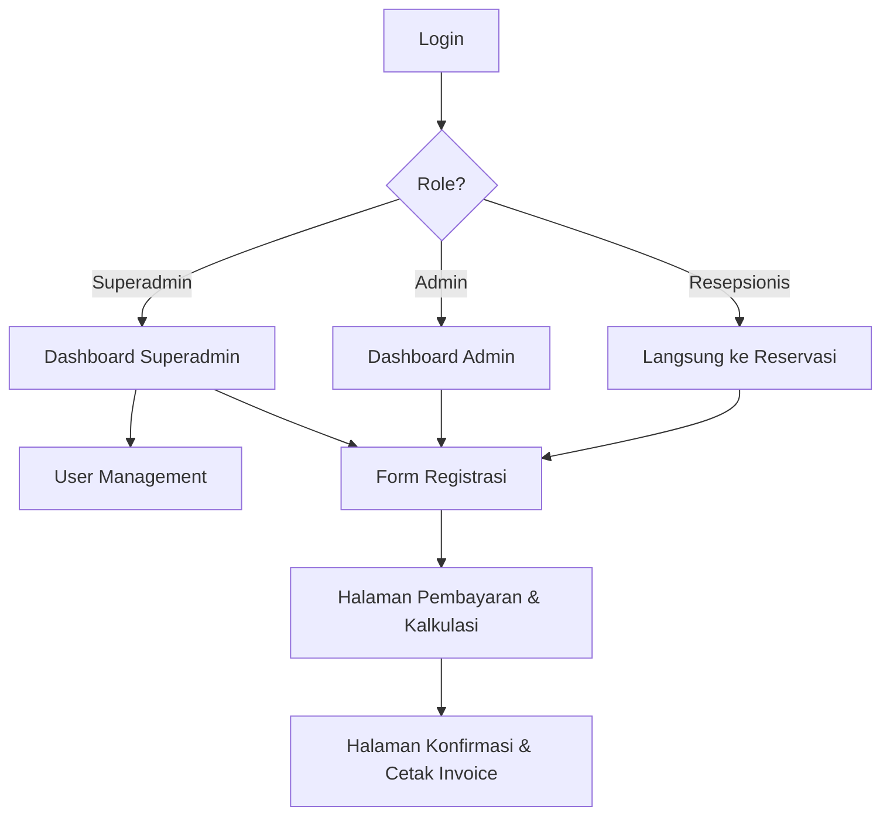

# 🏨 PPKD Hotel — Reservation System

Sebuah aplikasi web modern (berbasis React dan Supabase) untuk manajemen registrasi tamu, autentikasi berbasis role (Superadmin, Admin, Resepsionis), dan pembuatan invoice reservasi (A4 Print-ready).

---

## 🚀 Fitur Utama

### Autentikasi & Keamanan
- **Role-Based Access Control (RBAC):** Memisahkan hak akses antara `Superadmin`, `Admin`, dan `Resepsionis`.
- **Supabase Row Level Security (RLS):** Keamanan diterapkan di level database — bukan hanya di frontend. Bahkan jika user memanipulasi browser, RLS memblokir akses di backend.
- **Cookie-Based Token Storage:** Token autentikasi disimpan di cookies (bukan `localStorage`) dengan atribut keamanan `Secure`, `SameSite=Lax`, dan auto-expire 30 hari — lebih aman dari serangan XSS.
- **Auto Role Re-sync:** Role otomatis di-refresh saat user kembali ke tab browser, menangkap perubahan role oleh admin secara real-time.
- **Production Console Strip:** `console.log` secara otomatis dihapus saat build production via esbuild untuk menjaga keamanan dan performa. `console.error` dan `console.warn` tetap aktif.

### Dashboard Admin & Superadmin
- **Ringkasan Statistik:** Kartu statistik untuk Total Reservasi, Reservasi Aktif, Reservasi Selesai, dan Akan Datang.
- **Grafik Pendapatan:** Chart pendapatan harian (30 hari) dan bulanan (12 bulan) menggunakan Recharts.
- **Aktivitas Terbaru & List Reservasi:** Daftar lengkap reservasi dengan fitur:
  - 🔍 **Pencarian** berdasarkan nama tamu, booking no, dan nomor kamar.
  - 🏷️ **Filter Tipe Kamar** (Deluxe, Suite, Standard) dengan tombol dinamis.
  - 👁️ **Detail Modal** untuk melihat informasi lengkap reservasi.
  - 🖨️ **Print Confirmation** langsung dari dashboard.
- **Jam Real-Time Jakarta (WIB):** Ditampilkan di sudut kanan dashboard.

### Manajemen Pengguna (Superadmin)
- **CRUD Akun Staf:** Tambah, edit (email, password, role, username), dan hapus akun.
- **Pencarian & Filter:** Search bar dan filter berdasarkan role (Semua, Superadmin, Admin, Resepsionis).
- **Statistik Akun:** Kartu ringkasan Total Akun, Admin & Superadmin, dan Resepsionis.
- **Proteksi Superadmin:** Akun Superadmin tidak dapat diedit atau dihapus oleh akun lain.

### Reservasi & Pembayaran
- **Form Reservasi Dinamis:** Data tamu, kamar, dan periode menginap dengan validasi lengkap.
- **Kalkulasi Otomatis:** Harga kamar × malam × jumlah kamar + PPN 11% + Service Charge 5%.
- **Multi Metode Pembayaran:** Tunai (Cash), Transfer Bank (Mandiri), Kartu Kredit, dan E-Wallet (GoPay, OVO, DANA, LinkAja).
- **Kode Referensi Unik:** Otomatis dihasilkan untuk setiap transaksi non-tunai.
- **Cetak Invoice A4:** Konfirmasi reservasi siap cetak dalam format A4 Portrait.

### Manajemen Hotel & Ketersediaan Kamar
- **Profil Hotel & Tarif:** Pengaturan informasi hotel dan harga kamar (Room Rate) dengan antarmuka layar penuh (full-width) yang modern.
- **Pemantauan Status Kamar:** Update ketersediaan kamar secara real-time yang secara akurat menampilkan status Terisi, Tersedia, dan 'Upcoming'.
- **Safe Cancellation:** Modifikasi logika pembatalan (Cancel) di mana data transaksi tidak dihapus, melainkan diubah statusnya menjadi "Canceled" guna menjaga riwayat data transaksi.
- **Smart Announcement:** Pengumuman berjalan (running text) berbasis `sessionStorage`, hanya muncul sekali per sesi login agar tidak mengganggu keasyikan pengguna.

### UI/UX & Tema
- **Dynamic Login Page:** Halaman login dengan background animasi gradient yang dinamis dan memikat.
- **Light & Dark Mode Polish:** Polesan visual secara detail pada Light Mode (peningkatan kontras shadow) dan perbaikan tata letak.
- **Optimalisasi Layout:** Perombakan formasi tampilan (overhaul UI) pada area Dashboard dan User Management untuk kenyamanan pembacaan data.
- **Custom Alert & Redirection:** Notifikasi kustom tanpa menggunakan alert browser yang monoton, termasuk kelancaran transisi logout dengan automatic redirection.
- **Responsif & Modern:** Tampilan responsif adaptif untuk desktop & tablet via utilitas modern Tailwind CSS v4.

---

## 🛠 Tech Stack

| Layer | Teknologi |
|---|---|
| **Frontend** | [React](https://react.dev/) + [Vite](https://vite.dev/) |
| **Styling** | [Tailwind CSS v4](https://tailwindcss.com/) |
| **Routing** | [React Router DOM](https://reactrouter.com/) |
| **Charts** | [Recharts](https://recharts.org/) |
| **Backend & DB** | [Supabase](https://supabase.com/) (PostgreSQL + Auth + RLS) |
| **Security** | Supabase RLS + `SECURITY DEFINER` RPC + Cookie-Based Token Storage |
| **Deployment** | [Vercel](https://vercel.com/) (Dianjurkan) |

---

## 📋 Alur Kerja (Work Flow)



---

## 🔒 Arsitektur Keamanan

```
┌─────────────────────────────────────────────────┐
│  BROWSER (React)                                │
│  ProtectedRoute → UX guard (bukan security)     │
│  AuthContext    → fetches role dari server       │
├─────────────────────────────────────────────────┤
│  SUPABASE SERVER                                │
│  JWT → auth.uid() terverifikasi                 │
│  get_my_role() → cek role dari user_roles       │
│  RLS Policy → ALLOW / DENY di level query       │
│  ⛔ Manipulasi frontend TIDAK bisa bypass RLS   │
└─────────────────────────────────────────────────┘
```

---

## 🚀 Cara Instalasi & Setup

### 1. Clone & Install Dependencies
```bash
git clone https://github.com/RissN/hotel-app.git
cd hotel-app
npm install
```

### 2. Setup Supabase
1. Buat project baru di [Supabase](https://supabase.com).
2. Dapatkan `Project URL` dan `API Key (anon/public)`.
3. Buat file `.env` di folder root project:
   ```env
   VITE_PUBLIC_SUPABASE_URL=your_supabase_url
   VITE_PUBLIC_SUPABASE_ANON_KEY=your_supabase_anon_key
   ```

### 3. Setup Database (SQL Migrations)
Jalankan script SQL berikut di **SQL Editor** pada dashboard Supabase:

#### a. Tabel & Enum
```sql
CREATE TYPE user_role AS ENUM ('Superadmin', 'Admin', 'Resepsionis');

CREATE TABLE public.user_roles (
    user_id UUID REFERENCES auth.users(id) ON DELETE CASCADE PRIMARY KEY,
    role user_role NOT NULL DEFAULT 'Resepsionis',
    username TEXT DEFAULT '',
    created_at TIMESTAMP WITH TIME ZONE DEFAULT NOW()
);

ALTER TABLE public.user_roles ENABLE ROW LEVEL SECURITY;
```

#### b. Helper Function & RLS Policies
```sql
-- Helper: mendapatkan role user saat ini
CREATE OR REPLACE FUNCTION public.get_my_role()
RETURNS user_role
LANGUAGE sql STABLE SECURITY DEFINER
SET search_path = public
AS $$ SELECT role FROM public.user_roles WHERE user_id = auth.uid() $$;

-- RLS Policies untuk user_roles
CREATE POLICY "user_roles_select_own" ON public.user_roles FOR SELECT
  USING (auth.uid() = user_id);

CREATE POLICY "user_roles_select_admin" ON public.user_roles FOR SELECT
  USING (public.get_my_role() IN ('Superadmin', 'Admin'));

CREATE POLICY "user_roles_modify_admin" ON public.user_roles FOR ALL
  USING (public.get_my_role() IN ('Superadmin', 'Admin'))
  WITH CHECK (public.get_my_role() IN ('Superadmin', 'Admin'));
```

#### c. Fungsi Manajemen User (RPC)
```sql
-- Membuat user baru (digunakan oleh Superadmin di UI)
CREATE OR REPLACE FUNCTION create_user_by_admin(
  email text, password text, assign_role text, assign_username text DEFAULT ''
) RETURNS void LANGUAGE plpgsql SECURITY DEFINER AS $$
DECLARE new_user_id uuid;
BEGIN
  IF NOT EXISTS (SELECT 1 FROM user_roles WHERE user_id = auth.uid() AND role IN ('Admin','Superadmin')) THEN
    RAISE EXCEPTION 'Unauthorized';
  END IF;
  new_user_id := gen_random_uuid();
  INSERT INTO auth.users (id, instance_id, aud, role, email, encrypted_password, email_confirmed_at, created_at, updated_at)
  VALUES (new_user_id, '00000000-0000-0000-0000-000000000000', 'authenticated', 'authenticated', email, crypt(password, gen_salt('bf')), now(), now(), now());
  INSERT INTO auth.identities (id, user_id, identity_data, provider, provider_id, last_sign_in_at, created_at, updated_at)
  VALUES (new_user_id, new_user_id, format('{"sub":"%s","email":"%s"}', new_user_id::text, email)::jsonb, 'email', new_user_id::text, now(), now(), now());
  INSERT INTO user_roles (user_id, role, username) VALUES (new_user_id, assign_role::user_role, assign_username);
END; $$;

-- Menghapus user
CREATE OR REPLACE FUNCTION delete_user_by_admin(target_user_id uuid) RETURNS void LANGUAGE plpgsql SECURITY DEFINER AS $$
BEGIN
  IF NOT EXISTS (SELECT 1 FROM user_roles WHERE user_id = auth.uid() AND role IN ('Admin','Superadmin')) THEN
    RAISE EXCEPTION 'Unauthorized';
  END IF;
  DELETE FROM auth.users WHERE id = target_user_id;
END; $$;

-- Edit user (role, email, password, username)
CREATE OR REPLACE FUNCTION update_user_full_by_admin(
  target_user_id uuid, new_role text, new_email text, new_password text, new_username text DEFAULT ''
) RETURNS void LANGUAGE plpgsql SECURITY DEFINER AS $$
BEGIN
  IF NOT EXISTS (SELECT 1 FROM user_roles WHERE user_id = auth.uid() AND role IN ('Admin','Superadmin')) THEN
    RAISE EXCEPTION 'Unauthorized';
  END IF;
  UPDATE user_roles SET role = new_role::user_role, username = COALESCE(new_username, username) WHERE user_id = target_user_id;
  IF new_email IS NOT NULL AND new_email != '' THEN
    UPDATE auth.users SET email = new_email WHERE id = target_user_id;
    UPDATE auth.identities SET identity_data = jsonb_set(identity_data, '{email}', to_jsonb(new_email)) WHERE user_id = target_user_id;
  END IF;
  IF new_password IS NOT NULL AND new_password != '' THEN
    UPDATE auth.users SET encrypted_password = crypt(new_password, gen_salt('bf')) WHERE id = target_user_id;
  END IF;
END; $$;

-- Mendapatkan list user dengan email (untuk Admin/Superadmin)
CREATE OR REPLACE FUNCTION get_users_detailed_by_admin()
RETURNS TABLE (user_id uuid, role text, username text, email text, created_at timestamptz)
LANGUAGE plpgsql SECURITY DEFINER AS $$
BEGIN
  IF NOT EXISTS (SELECT 1 FROM user_roles ur WHERE ur.user_id = auth.uid() AND ur.role IN ('Admin','Superadmin')) THEN
    RAISE EXCEPTION 'Unauthorized';
  END IF;
  RETURN QUERY SELECT ur.user_id, ur.role::text, ur.username::text, au.email::text, ur.created_at
  FROM user_roles ur JOIN auth.users au ON au.id = ur.user_id ORDER BY ur.created_at DESC;
END; $$;
```

### 4. Jalankan Aplikasi
```bash
npm run dev
```
Buka `http://localhost:5173` di browser.

---

## 📖 Panduan Penggunaan

### 1. Halaman Login (`/login`)
Masuk dengan email dan password yang terdaftar. Sistem otomatis mendeteksi role dan mengarahkan ke halaman yang sesuai:
- **Superadmin / Admin** → Dashboard
- **Resepsionis** → Form Reservasi

### 2. Dashboard (`/dashboard`) — Admin & Superadmin
- Lihat ringkasan statistik reservasi dan grafik pendapatan.
- **Aktivitas Terbaru:** Gunakan search bar dan filter tipe kamar untuk menemukan reservasi tertentu.
- Klik **Detail** untuk melihat informasi lengkap, atau **Print** untuk cetak konfirmasi.

### 3. User Management (`/users`) — Superadmin
- **Tambah Pengguna:** Klik tombol "Tambah Pengguna" → isi email, password, role, dan username.
- **Edit / Hapus:** Gunakan tombol aksi di setiap baris tabel.
- **Filter & Cari:** Gunakan search bar dan tombol filter role untuk menemukan akun tertentu.

### 4. Formulir Reservasi (`/registration`)
Isi data tamu, kamar, dan tanggal menginap → klik **Submit & Generate Invoice** → konfirmasi data → lanjut ke pembayaran.

### 5. Halaman Pembayaran (`/payment`)
Kalkulasi otomatis: Harga Kamar × Malam × Jumlah Kamar + PPN 11% + Service 5%. Pilih metode pembayaran → klik **Proses Pembayaran**.

### 6. Invoice & Konfirmasi (`/confirmation`)
Bukti reservasi resmi. Klik **Print Confirmation** → pastikan printer di ukuran **A4 Portrait**.

---

## 📌 Kebijakan Hotel PPKD

1. Waktu Check-in: **14.00 PM**
2. Waktu Check-out: **12.00 PM**
3. Reservasi **tanpa jaminan** dibatalkan otomatis pada pukul **18.00**.
4. Pembatalan reservasi **bergaransi** setelah hari kedatangan dikenakan biaya penalty sebesar **1 malam**.
